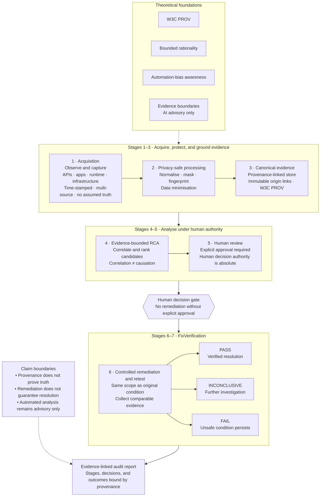

# PrivacyTrace-NP

**Academic research prototype** for governed privacy monitoring and incident traceability in Nepalese digital financial service (DFS) API log and event streams.

| Field | Detail |
| --- | --- |
| Module | **ST6047CEM** Cyber Security Project |
| Level | Year Three (undergraduate) |
| Institution | Softwarica College of IT & E-Commerce × Coventry University, UK |
| Author | Biplav Basnet |
| Module leader | Manoj Shrestha (`stw0002@softwarica.edu.np`) |
| Repository | [BiplavBasnet/ST6047CEM-Privacytrace-NP](https://github.com/BiplavBasnet/ST6047CEM-Privacytrace-NP) |
| License | [MIT](LICENSE) |

This repository is submitted as a **Bachelor-level cybersecurity project artefact**. It is a controlled laboratory prototype for academic evaluation. It is **not** a production security product, regulator certification, or legal-compliance claim.

---

## 1. Research problem

Digital financial services in Nepal increasingly expose sensitive customer and credential material through API logs, operational telemetry, and security tooling. Conventional monitoring stacks often surface raw or weakly masked events, while investigation workflows rarely preserve a governed chain from detection through human review, remediation, controlled retest, and verification.

**PrivacyTrace-NP** investigates whether a privacy-preserving, evidence-grounded incident pipeline can:

1. detect sensitive instances in synthetic and controlled log/event inputs;
2. mask exposure before analyst display and reporting;
3. support ranked likely-cause analysis from available evidence;
4. enforce human review and role-based access before high-impact actions;
5. record remediation and verify outcomes through a conservative controlled-retest model.

---

## 2. Scope and claim boundaries

### In scope

- End-to-end governed incident lifecycle on a frozen application build
- Detection and exposure classification on a sealed held-out evaluation pack
- Controlled RCA **signal-ranking** on synthetic evidence signals
- Supplementary verification of exported policy functions
- Runtime connector and evidence-import demonstration paths
- Optional AI remediation **assistant** (advisory only; human-reviewed; disabled by default)

### Out of scope / not claimed

- Real-world production DFS deployment or regulatory approval
- Uncontrolled real-world RCA accuracy equivalent to the synthetic ranking subset
- Live Wazuh Manager or GitHub-hosted workflow integration as evaluated connectors
- Autonomous incident closure, blame attribution, or calibrated probabilistic risk scores

Authoritative research boundaries: [`docs/thesis_evidence/THESIS_CLAIM_BOUNDARIES.md`](docs/thesis_evidence/THESIS_CLAIM_BOUNDARIES.md)  
Evaluation summary: [`docs/thesis_evidence/EVALUATION_SUMMARY.md`](docs/thesis_evidence/EVALUATION_SUMMARY.md)

---

## 3. Conceptual architecture

PrivacyTrace-NP is organised as an **evidence-governed investigation pipeline**. Automated analysis may assist ranking and drafting, but consequential remediation actions require explicit human approval. Provenance links support accountability; they do not prove absolute truth.

### Theoretical foundations

| Foundation | Design implication |
| --- | --- |
| **W3C PROV** | Evidence origin and transformation are recorded as linked provenance |
| **Bounded rationality** | Analyst decisions are made under incomplete information |
| **Automation-bias awareness** | Human oversight remains mandatory for consequential decisions |
| **Evidence boundaries** | AI / automated assistance is advisory only — not independent evidence |

### Thesis conceptual diagram



**Pipeline reading (Stages 1–7):**

1. **Acquisition** — observe and capture multi-source events; no assumption of truth.  
2. **Privacy-safe processing** — normalise, mask, and fingerprint; minimise retained sensitive data.  
3. **Canonical evidence** — store minimised evidence with authentic provenance links.  
4. **RCA** — correlate sources and rank plausible cause candidates (correlation is not causation).  
5. **Human review** — explicit approval before any remediation path.  
6–7. **FixVerification** — controlled retest under comparable scope → **PASS** / **INCONCLUSIVE** / **FAIL**.  

Final output is an **evidence-linked audit report**. Claim boundaries remain: provenance ≠ truth; remediation ≠ guaranteed fix; automation remains advisory.

### Implementation stack

| Layer | Technology |
| --- | --- |
| API | FastAPI, SQLAlchemy, Alembic |
| Data store | PostgreSQL |
| UI | React + TypeScript |
| Connectors | Runtime / Evidence Import / controlled ScannerBridge import |
| Evaluation | Offline held-out pack + supplementary verification harness |

Further detail: [`docs/ARCHITECTURE.md`](docs/ARCHITECTURE.md).

---

## 4. Repository layout

```text
Privacytrace-NP/
├── backend/                 # FastAPI application, models, services, tests
├── frontend/                # Investigator console
├── connectors/              # Runtime and related connector packages
├── evaluation/              # Sealed research evaluation packs (held-out, supplementary, ablation)
├── docs/                    # Academic docs + thesis evidence (see docs/README.md)
├── fixtures/                # Synthetic fixtures for demonstration
├── scripts/                 # Operational and test helper scripts
├── docker-compose.yml       # Local PostgreSQL
├── LICENSE
└── README.md
```

---

## 5. Reproducibility identities

| Identity | Value |
| --- | --- |
| Application freeze SHA | `8b22b670a82b61882cb841b10a9f4d364de30bc7` |
| Thesis evidence snapshot SHA | `99a646aa55f0c126d8aa911223cc76eab7f32e9d` |
| Held-out evaluation run | `EVAL-HO80-20260817-1` |
| Held-out pack SHA-256 | `2cd8f1c3b2d831cc5f042e06475868d9b3f583ff75e3f7a7971f46e404cf572b` |
| Supplementary verification | `SUPP-VERIFY-20260817-1` (24 declared; 22 executed; 2 rollback not executed) |
| NepalFin lab SHA | `ae77b8ee4c62b5171c2b3ca08a44fe0ee405c0ee` |

Freeze and evidence packaging notes: [`docs/CODE_FREEZE_MANIFEST.md`](docs/CODE_FREEZE_MANIFEST.md), [`docs/thesis_evidence/archives/ARCHIVE_MANIFEST.md`](docs/thesis_evidence/archives/ARCHIVE_MANIFEST.md).

---

## 6. Quick start (development laboratory)

### Prerequisites

- Docker Desktop (or Docker Engine + Compose)
- Python 3.11+
- Node.js 18+ (frontend)

### Database

```powershell
docker compose up -d
docker compose ps
```

### Backend

```powershell
copy .env.example backend\.env
cd backend
python -m venv .venv
.\.venv\Scripts\Activate.ps1
pip install -r requirements.txt
alembic upgrade head
uvicorn app.main:app --reload --host 127.0.0.1 --port 8000
```

Health check:

```powershell
Invoke-RestMethod http://127.0.0.1:8000/health
```

Normal onboarding after a fresh migration:

```text
bootstrap Platform Operator → /setup → Organisation → first Organisation Admin → company verification → application
```

See [`docs/ORGANISATION_DEPLOYMENT.md`](docs/ORGANISATION_DEPLOYMENT.md). Demo seed scripts are for laboratory demonstration only and are not production onboarding.

### Frontend

```powershell
cd frontend
npm install
npm run dev
```

### Tests (backend)

```powershell
cd backend
.\.venv\Scripts\Activate.ps1
pytest app/tests/test_health.py -v
```

Database-backed suites require PostgreSQL and an explicit opt-in. Prefer:

```powershell
python scripts/run_backend_tests_with_postgres.py
```

**Warning:** the backend suite may drop and recreate tables on the configured `DATABASE_URL`. Do not run full pytest against a database whose data must be retained.

---

## 7. Evaluation artefacts

| Pack | Location | Purpose |
| --- | --- | --- |
| Held-out 80 | `evaluation/heldout/` | Sealed detection / RCA / leakage research evaluation |
| Supplementary verification | `evaluation/supplementary_verification/` | Policy-function verification states (PASS/FAIL/INCONCLUSIVE and related gates) |
| Ablation | `evaluation/ablation/` | Causality-engine evidence-context ablation (not held-out RCA) |
| Thesis evidence | `docs/thesis_evidence/` | Screenshots, ledger, claim boundaries, archives |

Do not mix engineering pytest pass counts with research performance metrics.

---

## 8. Detection language (terminology discipline)

| Term | Meaning in this prototype |
| --- | --- |
| Detection | Masked pattern/taxonomy match that a sensitive field may be present |
| Exposure profile | Combination-rule assessment of how detected categories co-occur |
| Suspected breach alert | Internal alert in `suspected` state; not a verified breach |
| Verified breach | Requires approved privacy-impact assessment plus human-reviewed verification |
| Rule score | Deterministic weighted score from YAML/rules; **not** a calibrated probability |

---

## 9. Security and ethics notes

- Secrets belong in local `.env` files (never committed). Use `.env.example` as a template.
- Outputs and screenshots used for evaluation are expected to remain privacy-safe (masked).
- Optional AI remediation suggestions are advisory only, fail closed when misconfigured, and must not replace human review, fix verification, or controlled retest evidence.
- Synthetic laboratory data (including NepalFin) must not be presented as production customer data.

---

## 10. Documentation map

| Document | Content |
| --- | --- |
| [`docs/README.md`](docs/README.md) | Documentation index (kept academic set only) |
| [`docs/thesis_evidence/EVALUATION_SUMMARY.md`](docs/thesis_evidence/EVALUATION_SUMMARY.md) | Final evaluation narrative (15 sections) |
| [`docs/thesis_evidence/THESIS_CLAIM_BOUNDARIES.md`](docs/thesis_evidence/THESIS_CLAIM_BOUNDARIES.md) | What the evidence does and does not support |
| [`docs/thesis_evidence/SCREENSHOT_LEDGER.md`](docs/thesis_evidence/SCREENSHOT_LEDGER.md) | Screenshot catalogue and MAIN figure set |
| [`docs/ARCHITECTURE.md`](docs/ARCHITECTURE.md) | System architecture |
| [`docs/CONNECTOR_FRAMEWORK.md`](docs/CONNECTOR_FRAMEWORK.md) | Connector model |
| [`docs/LIVE_PRIVACY_MONITOR.md`](docs/LIVE_PRIVACY_MONITOR.md) | Live monitor workflow |
| [`docs/AI_REMEDIATION_ASSISTANT.md`](docs/AI_REMEDIATION_ASSISTANT.md) | Optional advisory AI assistant (product feature) |

---

## 11. Licence

Released under the [MIT License](LICENSE). Copyright © 2026 Biplav Basnet.

Academic reuse is permitted with attribution. Thesis text and marking materials remain subject to Softwarica College / Coventry University academic integrity rules.

---

## 12. Disclaimer

PrivacyTrace-NP is provided for **education and research demonstration**. The authors accept no liability for operational deployment, regulatory decisions, or incident-response outcomes derived from this prototype.
