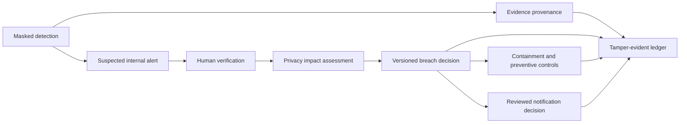

# PrivacyTrace-NP Architecture

PrivacyTrace-NP uses thin FastAPI routers, SQLAlchemy persistence, service-layer policy logic, versioned YAML rules, and a React incident workspace.

## Integrated governance flow

`PrivacyAlert` remains the live detector observation. `BreachAlert` is the assessed customer-exposure alert. The incident timeline is derived from domain records and safe audit events rather than copied into another mutable table.

The Nepal financial taxonomy and exposure-combination rules are authoritative versioned YAML. Database rows persist classifications, HMAC fingerprints, review state, and explainable profile results only.

## Unified ingestion pipeline

Live monitor, detection, scanner bridge, and SIEM import call the shared
`privacy_ingestion_pipeline_service` to classify fields, persist
`SensitiveDataClassification` rows (`commit=False`), and refresh exposure
profiles. Callers own the surrounding transaction and commit.

Provenance follows the same ownership rule: ingestion and bridge services call
`record_system_provenance(..., commit=False)` (optionally
`append_integrity=True`) and then commit themselves. The provenance service
does not commit by default.

See the focused documents for decision history, provenance, integrity, counterfactual analysis, alert operations, preventive controls, taxonomy, exposure profiles, and restricted AML handling.
