# Phase 11.85 — ScannerBridge-NP

## Purpose

ScannerBridge-NP is a privacy-safe adapter layer that imports **external scanner outputs** into PrivacyTrace-NP as **supporting evidence** linked to incidents. It validates and masks findings, persists canonical scanner evidence metadata (never raw scanner dumps), and scores **causal relevance** for human review.

It does **not**:

- Change detection, masking rules, or the root-cause engine
- Invoke LLM analysis automatically
- Mutate incident status or fix verification
- Replace Phase 12 scope

## Architecture

```mermaid
flowchart LR
  upload[Upload or JSON body] --> adapter[scanner_adapter_service]
  adapter --> validate[scanner_validation_service]
  validate --> safety[scanner_safety_service]
  safety --> map[scanner_mapping_service]
  map --> persist[evidence_files + scanner_evidence_records]
  persist --> correlate[scanner_correlation_service]
  correlate --> api[Safe API responses]
  api --> ui[ScannerBridge-NP UI]
```

| Layer | Role |
|--------|------|
| `evidence_files` | One row per import batch (`scanner_bridge_import`), `file_hash` = SHA-256 of sanitised payload |
| `scanner_evidence_records` | One row per normalised finding (masked metadata, causal score, fingerprint) |
| `secret_findings` / `sast_findings` | Optional dual-write for compatibility with existing evidence views |

## API (`/scanner-bridge`)

| Method | Path | Permission |
|--------|------|------------|
| POST | `/preview` | `scanner_bridge:import` |
| POST | `/import` | `scanner_bridge:import` |
| GET | `/evidence` | `scanner_bridge:read` |
| GET | `/evidence/{id}` | `scanner_bridge:read` |
| POST | `/evidence/{id}/link` | `scanner_bridge:import` |
| GET | `/incidents/{id}/scanner-evidence` | `incident:read` |
| POST | `/incidents/{id}/correlate` | `scanner_bridge:read` |

## Supported formats

1. `generic_secret_scanner_json`
2. `external_secret_scanner_json` (NDJSON or array)
3. `gitleaks_json`
4. `semgrep_sarif`
5. `semgrep_json`

Sample payloads: `backend/app/sample_data/scanner_outputs/`.

## Demo checklist

1. Log in as admin or security analyst.
2. Open **ScannerBridge-NP** (`/scanner-bridge?incident=INC-SEED-001`).
3. Paste a sample JSON from `scanner_outputs/` (masked values only).
4. **Preview** → confirm `import_allowed: true`.
5. **Import** → note `scanner_evidence_ids`.
6. **Run correlation** → review strong/moderate/weak buckets; confirm `human_review_required: true`.

## Limitations

- Payload hash only — no full JSON retention
- Rule-based correlation; not a substitute for analyst judgment
- Five adapters only; unknown shapes rejected at boundary

## Developer note

Open-source scanner **output formats** are supported via neutral adapters for thesis demonstration. PrivacyTrace-NP does not claim ownership of third-party scanners; UI and routes use **ScannerBridge-NP** branding only.

## Not implemented (by design)

- Phase 12 automation
- Auto root-cause override
- Live scanner webhooks / scheduled sync
