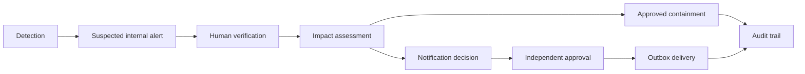

# Privacy Harm and Breach Response

## Purpose

This module turns masked sensitive-data detections into reviewed internal exposure alerts, explainable privacy-impact assessments, pseudonymous affected-subject references, approved credential-containment actions, and reviewed customer-notification decisions.

It provides investigation and policy-alignment support only. It is not a legal determination, regulatory decision, or compliance certification.

## Architecture



The existing `PrivacyAlert` remains the live detector alert. `BreachAlert` is the assessed customer-exposure alert. Existing remediation records remain unchanged; `ContainmentAction` has a separate approval and execution lifecycle because credential actions may affect access.

Core backend areas:

- Models: `privacy_impact.py`, `affected_subject.py`, `breach_alert.py`, `containment_action.py`, and `customer_notification.py`.
- Services: impact scoring, alert evaluation, pseudonymous subject resolution, containment, notification decisions, outbox processing, and provider interfaces.
- Rules: `backend/app/rules/privacy_impact_rules.yaml`.
- API: `privacy_impact_router.py` and `privacy_response_router.py`.
- UI: incident Overview, Remediation, and Human Review pages.

## Assessment Methods

### Breach severity

The ENISA-inspired technical score is:

```text
breach severity = data processing context * ease of identification + circumstances
```

The data-processing-context score is the highest applicable configured category score. All considered categories are retained as explainable factors. Ease of identification accepts `0.25`, `0.50`, `0.75`, or `1.00`. Circumstance contributions are configuration-driven and require reasons and evidence references.

Default levels:

| Score | Level |
| --- | --- |
| Below 2 | low |
| 2 to below 3 | medium |
| 3 to below 4 | high |
| 4 or above | very_high |

### Potential privacy harm

Potential harm is calculated separately:

```text
privacy harm = likelihood * magnitude
```

Likelihood and magnitude are integers from 1 to 4. The overall result uses the highest supported harm score; unrelated harms are not summed.

| Score | Level |
| --- | --- |
| 1-3 | low |
| 4-7 | medium |
| 8-11 | high |
| 12-16 | critical |

Each harm stores its category, evidence references, explanation, uncertainty, and recommended mitigation.

### Taxonomy and exposure inputs

Assessment merges:

- Legacy detections mapped to impact categories.
- Current `SensitiveDataClassification` rows for the incident (retest-role classifications are skipped).
- Current exposure profiles (KYC/identity, account-takeover/credential, merchant/financial profile types raise related categories).

Credential presence can come from the request, credential-type detections, taxonomy authentication credentials, or account-takeover exposure profiles.

Restricted AML / compliance categories remain **internal-only**. They must not
drive customer notification content or external disclosure; see
[RESTRICTED_AML_POLICY.md](RESTRICTED_AML_POLICY.md).

### Terms that must remain separate

- Detection confidence: detector certainty that a masked pattern matches a sensitive-data type.
- Root-cause confidence: evidence support for a likely technical cause.
- Breach severity: technical impact score from data context, identifiability, and circumstances.
- Potential privacy harm: likely effect on an affected person.
- Alert severity: operational urgency used to prioritise internal response.
- Notification recommendation: reviewed decision about whether protective customer communication is appropriate.

None of these values alone confirms a breach or establishes a legal obligation.
Rule scores are not calibrated probabilities.

## Lifecycle

### Alerts

A detector match may immediately create a `suspected` internal alert. It cannot create a verified breach by itself. An alert becomes `verified` only when the privacy-impact assessment is approved and the incident already has a human-reviewed verified status.

Stable deduplication keys use the incident, alert type, sorted data categories, credential state, and assessment version. Re-evaluating identical inputs returns the existing assessment and alert.

Critical internal alert rules include active credentials, public credential exposure, identifiable financial information, confirmed exfiltration, confirmed malicious access, very-high breach severity, critical privacy harm, and multiple affected subjects with confirmed external access.

### Affected subjects

The API accepts a directory lookup token as a secret input and immediately converts it to an HMAC-SHA256 pseudonymous reference. The raw lookup token is not persisted or returned. A plain or unsalted customer-identifier hash is not used.

Development can use a synthetic directory adapter. Production resolution and destination lookup remain disabled until an approved customer-directory integration is implemented. Notification destinations are resolved only during delivery and are not written to application or audit logs.

### Credential containment

Credential exposure creates a recommendation such as token revocation, API-key rotation, session invalidation, password reset, or manual action. Admin approval is required. A DevSecOps Engineer executes an approved action, and the same person cannot both approve and execute it.

The runtime provider is non-destructive. It records that manual execution is required and never calls a production identity or credential system.

### Customer notification

Drafting requires:

- A human-verified incident.
- An approved privacy-impact assessment.
- A resolved, eligible pseudonymous affected subject.
- High or critical potential privacy harm, or a future configured policy recommendation.

Drafts use factual uncertainty language and exclude raw exposed values, credentials, full identifiers, blame, and legal conclusions. The draft creator cannot approve the same notification. Queueing is blocked while external sending is disabled.

Delivery uses an outbox with a unique notification/channel constraint and a stable idempotency key. Attempts store status, provider references, and error categories, never the destination or message body in logs. Processing is an injectable service operation; no public processing endpoint or background worker is enabled.

## RBAC

| Role | Access |
| --- | --- |
| Security Analyst | Assess, reassess, resolve subjects, manage alerts, draft notifications |
| Admin | Approve assessments, containment, and notifications; queue approved notifications |
| DevSecOps Engineer | Execute approved containment |
| Auditor | Read-only assessment, alert, containment, notification, and delivery history |
| Developer / Viewer | No module access |

Important transitions are recorded in the existing audit trail using IDs, state changes, reason codes, counts, and evidence references only.

## Configuration

Set secrets through the environment. Never commit real values.

```dotenv
BREACH_ALERTS_ENABLED=true
CUSTOMER_NOTIFICATION_SEND_ENABLED=false
CREDENTIAL_AUTO_CONTAINMENT_ENABLED=false
BREACH_SEVERITY_MEDIUM_THRESHOLD=2.0
BREACH_SEVERITY_HIGH_THRESHOLD=3.0
BREACH_SEVERITY_VERY_HIGH_THRESHOLD=4.0
PRIVACY_HARM_MEDIUM_THRESHOLD=4
PRIVACY_HARM_HIGH_THRESHOLD=8
PRIVACY_HARM_CRITICAL_THRESHOLD=12
BREACH_CREDENTIAL_CATEGORIES=authorization_header,jwt_token,bearer_token,api_key,password,access_token,session_token,private_key
BREACH_INTERNAL_RECIPIENTS=
BREACH_WEBHOOK_DESTINATIONS=
NOTIFICATION_RETRY_COUNT=3
NOTIFICATION_RETRY_DELAY_SECONDS=60
ALERT_DEDUPLICATION_WINDOW_SECONDS=3600
SUBJECT_REFERENCE_HMAC_KEY=replace-with-a-secret
BREACH_WEBHOOK_SIGNING_KEY=
```

Production startup rejects the development HMAC key. Customer sending remains disabled because no production delivery provider is connected. Webhook HMAC signing is available to future adapters, but this module performs no network call.

## API

Assessment and alert routes:

- `POST /incidents/{incident_id}/privacy-impact/assess`
- `GET /incidents/{incident_id}/privacy-impact`
- `POST /privacy-impact/{assessment_id}/review`
- `POST /privacy-impact/{assessment_id}/approve`
- `GET /incidents/{incident_id}/alerts`
- `POST /alerts/{alert_id}/acknowledge`
- `POST /alerts/{alert_id}/resolve`
- `POST /alerts/{alert_id}/mark-false-positive`

Subject, containment, and notification routes:

- `GET /incidents/{incident_id}/affected-subjects`
- `POST /incidents/{incident_id}/affected-subjects/resolve`
- `GET /incidents/{incident_id}/containment-actions`
- `POST /containment-actions/{action_id}/approve`
- `POST /containment-actions/{action_id}/execute`
- `GET /incidents/{incident_id}/customer-notifications`
- `POST /incidents/{incident_id}/customer-notifications/draft`
- `POST /customer-notifications/{notification_id}/approve`
- `POST /customer-notifications/{notification_id}/reject`
- `POST /customer-notifications/{notification_id}/queue`
- `GET /customer-notifications/{notification_id}/delivery-status`

Example assessment request:

```json
{
  "data_categories": ["authentication_data"],
  "ease_of_identification_score": 0.75,
  "credential_exposure_present": true,
  "credential_access_impact": "customer_account",
  "limitations": ["Credential validity requires human verification."]
}
```

Only masked evidence IDs and reviewed categories belong in assessment requests. Unknown fields are rejected.

## Security and Privacy Safeguards

- Raw customer data and credentials are excluded from alert, audit, error, webhook, and browser-storage payloads.
- Request schemas forbid unknown mutation fields and constrain lifecycle values and text lengths.
- Customer references use keyed HMAC pseudonymisation.
- Detector matches create suspected alerts, not verified breach claims.
- Assessment approval, containment execution, and customer notification use human review and separation of duties.
- External delivery, directory calls, and destructive credential actions are disabled by default.
- Test fixtures use synthetic values and providers; tests make no external network call.

## Known Limitations

- No production customer-directory, email, webhook-delivery, or credential provider is connected.
- No background outbox worker is enabled; deployments must add an authenticated internal worker around the service operation.
- `BREACH_INTERNAL_RECIPIENTS`, `BREACH_WEBHOOK_DESTINATIONS`, and the deduplication window are reserved for a future approved provider/policy integration.
- Policy-specific legal timelines and jurisdiction decisions are outside this module.
- The Privacy Incident Scenario Laboratory is intentionally excluded.
